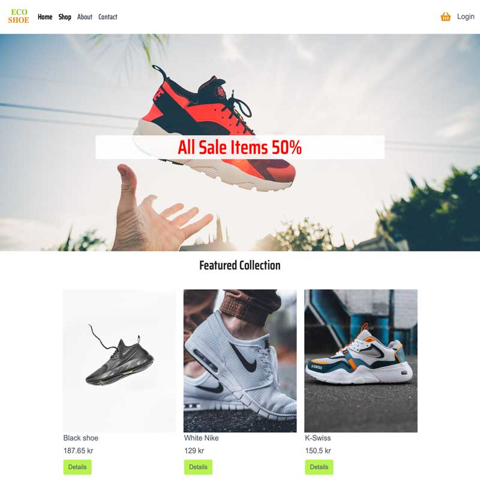

# Eco shoe



Eco shoe is an e-commerce that provides ethically made products.

### Table of Contents

- [Description](#description)
- [Built With](#built-with)
- [Getting Started](#getting-started)
- [Contact](#contact)

## Description

Eco shoe is an e-commerce that provides ethically made products as a lot of customers are getting concerned about how materials are being processed and made in concern with world pollution.

- To provide a good quality products
- To fight environmental pollution

## Built With

- [Bootstrap](https://getbootstrap.com)
- [Strapi](https://strapi.io/)
- [JavaScript](https://www.javascript.com/)
- [HTML & CSS](https://html.com/)
- [Google fonts](https://fonts.google.com/)

## Getting Started

### Installing

This is where you list how to get the project started. It typically just includes telling a person to clone the repo and then to install the dependencies e.g.

1. Clone the repo:

```bash
git clone https://github.com/HamoudBalawi/semester-project2-mohammed-ahmed
```

2. Install the dependencies:

To install strapi locally, run the followinf commands:

```
npm install
npm run develop
```

### Running

To run the strapi, run the following commands:

```bash
npm run start
```

The admin panel will open at `http://localhost:1337/admin`.

If you get a warning about not being able to use port 1337, check that no other Strapi instances are running in another command line or terminal.

## Contributing

Here you can detail any information you want to provide regarding contributing to the project. For big projects you will usually have a separate `CONTRIBUTING.md` and link to it, but for smaller projects you can simply include instructions here. These instructions can simply detail the process you want a person to take, such as to make sure to open a pull request so code can be reviewed.

## Contact

This is where you can leave your social links for people to contact you, such as a LinkedIn profile or Twitter link e.g.

[My Twitter page](www.twitter.com)

[My LinkedIn page](www.linkedin.com)
