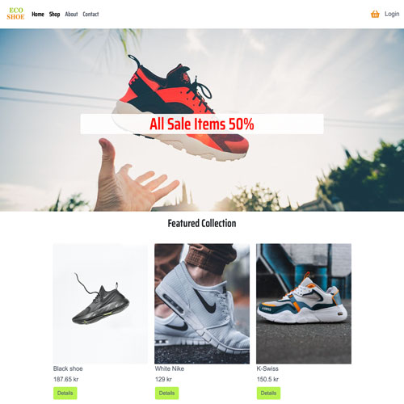

# Eco shoe



Eco shoe is an e-commerce that provides ethically made products.

### Table of Contents

- [Description](#description)
- [Built With](#built-with)
- [Getting Started](#getting-started)
- [Contact](#contact)

## Description

Eco shoe is an e-commerce that provides ethically made products as a lot of customers are getting concerned about how materials are being processed and made in concern with world pollution.

- To provide a good quality products
- To fight environmental pollution

## Built With

- [Bootstrap](https://getbootstrap.com)
- [Strapi](https://strapi.io/)
- [JavaScript](https://www.javascript.com/)
- [HTML & CSS](https://html.com/)


## Getting Started

### Installing

1. Clone the repo:

```bash
git clone https://github.com/HamoudBalawi/semester-project2-mohammed-ahmed
```

## Contact

[Instagram](https://www.instagram.com/hamoud_balawi/)


[Back To The Top](#eco-shoe)
